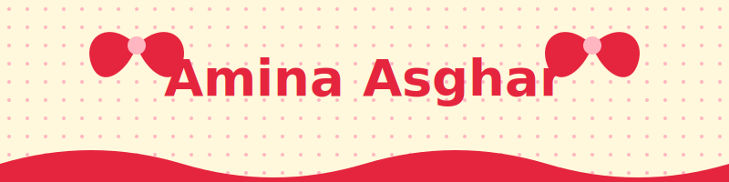
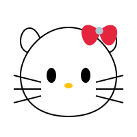
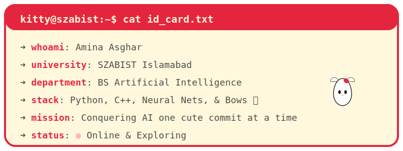
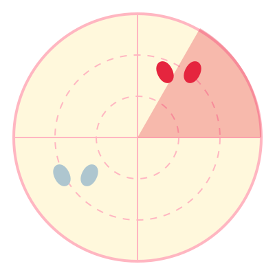
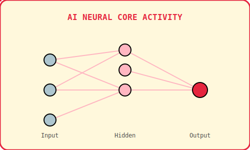
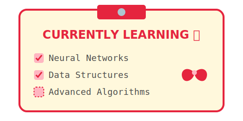
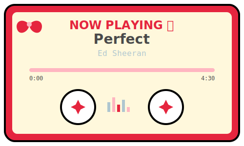
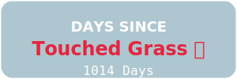
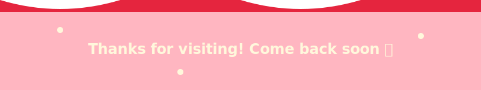

  
   
  <!-- Typing SVG -->
  
  
  <h3>BS Artificial Intelligence @ SZABIST Islamabad</h3>
  
  <!-- Social Links -->
  

    
    
  

<!-- Hello Kitty ID Card Terminal -->

<!-- Bow Radar -->

  <h2>🎀 Bow Radar</h2>
  
<i>Bow sense is tingling... detecting nearby bugs and cute things.</i>

  

<!-- Ribbon Stack (Tech Skills) -->

  <h2>ribbon stack 🧵</h2>
  

<!-- Bow Collection (Projects) -->

  <h2>bow collection 🎀</h2>
  
Current AI missions & creative projects.

  <table>
    <tr>
      <td width="50%" align="center">
        
         <b>AI Exploration</b>
         Machine Learning & Neural Networks
      </td>
      <td width="50%" align="center">
        
         <b>Computer Vision</b>
         Object detection & Image processing
      </td>
    </tr>
  </table>

<!-- Kitty Telemetry (GitHub Stats) -->

  <h2>kitty telemetry 📊</h2>
  
  
   
  

<!-- Bow-o-Meter (Yearly Commits Boss Bar) -->

  <h2>bow-o-meter 📈</h2>
  
Yearly commit progress: Unraveling the ribbon!

  <!-- This SVG is dynamically updated by GitHub Actions -->
  

<!-- Kitty's Neural Core -->

  <h2>kitty's neural core 🧠</h2>
  
Visualizing AI data paths in real-time...

  

<!-- Study Log -->

  <h2>study log 📚</h2>
  

<!-- Contribution Snake Game -->

  <h2>contribution snake 🐍</h2>
  
Watch the snake eat her GitHub contributions!

  <!-- Output of the GitHub Action Snake workflow -->
  

<!-- Cassette Tape Now Playing -->

  <h2>now playing 🎧</h2>
  

<!-- Outdoor Streak Counter -->

  <h2>outdoor streak counter 🌿</h2>
  

<!-- Kitty Passport -->

  <h2>kitty's passport 🛂</h2>
  
Places explored & dream destinations

  
    
  
  

<!-- Kitty Cafe Location HUD -->

  <h2>cafe location hud 🗺️</h2>
  
  

<!-- Leave a Bow Guestbook -->

  <h2>leave a bow 🎀</h2>
  
Sign my guestbook! Click the bow to leave a GitHub issue.

  

<!-- Kitty's Agenda (Fixed Width & Colors) -->

  <h2>kitty's agenda 📋</h2>
  <table width="100%" border="0">
    <tr>
      <td width="50%" align="center" valign="top">
        
          
        
BS-AI Student SZABIST Islamabad

      </td>
      <td width="50%" align="center" valign="top">
        
          
        
Machine Learning Neural Networks Data Structures

      </td>
    </tr>
    <tr>
      <td width="50%" align="center" valign="top">
         
        
          
        
Watching Movies Going Outside Listening to Music

      </td>
      <td width="50%" align="center" valign="top">
         
        
          
        
Optimizing models Cafe hopping Catching sunsets

      </td>
    </tr>
  </table>

  
<b>CLICK TO REVEAL SECRET IDENTITY 🤫🎀</b>

   
  

    
     <b>Identity:</b> Amina Asghar
     <b>Alter Ego:</b> Hello Kitty (but make it AI)
     <b>Superpower:</b> Debugging C++ code while painting her nails red.
     <b>Weakness:</b> Unoptimized algorithms and bad movie endings.
  

 

